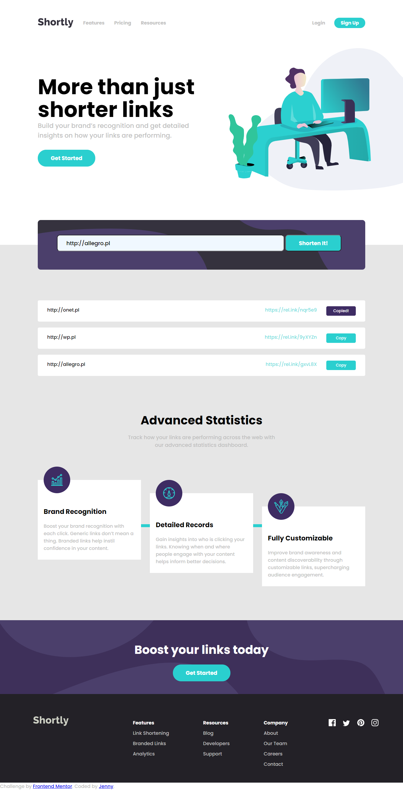
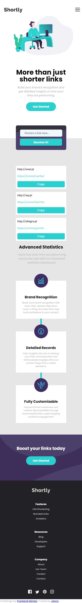

# Shortly URL

## General Info

Goal of project is to build out this landing page, integrate with the [rel.ink](https://rel.ink) API and get it looking as close to the design as possible.
Users should be able to:
- View the optimal layout for the site depending on their device's screen size
- Shorten any valid URL
- See a list of their shortened links, even after refreshing the browser
- Copy the shortened link to their clipboard in a single click
- Receive an error message when the `form` is submitted if:
  - The `input` field is empty

## Technologies
* HTML 
* CSS 
* [BEM](http://getbem.com/introduction/)
* JavaScript
* [Fetch API](https://developer.mozilla.org/en-US/docs/Web/API/Fetch_API)

## Screenshots

## Setup
How to run this project.
1. Clone this repo
2. Just open index.html

## Status
Project is finished.

## License
MIT

